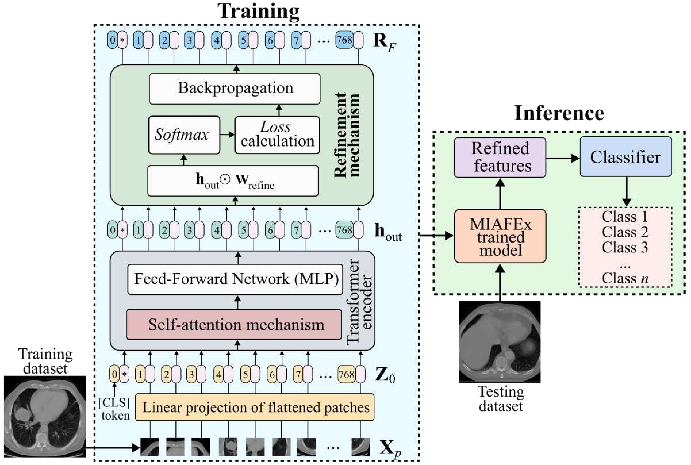

# MIAFEx: An Attention-based Feature Extraction Method for Medical Image Classification

[](https://doi.org/10.1016/j.knosys.2025.114468)
[](LICENSE)

**MIAFEx** refines the Transformer [CLS] token with learnable weights to produce robust features for medical image classification, particularly effective on small/medium datasets. It ships a full pipeline: supervised training, feature extraction, classical classifiers (LR/SVM/RF/XGB) inference, and wrapper-based feature selection (PSO/DE/GA).



MIAFEx refines the Vision Transformer (ViT) CLS token with learnable per-dimension weights to produce robust descriptors for medical image classification.  
This repository contains two main entry-point scripts:

- **Training** → `train_miafex.py`
- **Feature Extraction** → `extract_miafex_features.py`

---

##  Features
- ViT backbone with learnable refinement weights over the CLS token
- One-file checkpoint (`miafex_checkpoint.pth`) containing ViT + refinement + FC
- Descriptor export to CSV + NPY (features of the images in the test set)
- Optional quick ML sanity check (LR, SVM, RF, GB, KNN), and wrapper-based feature selection (WFS) using Metaheuristic algorithms and kNN.
---

##  Installation

### Conda (recommended)
```bash
conda create -n miafex python=3.10 -y
conda activate miafex
pip install torch torchvision --index-url https://download.pytorch.org/whl/cu121  # adjust CUDA if needed
pip install numpy pandas scikit-learn xgboost matplotlib tqdm pyyaml timm transformers

./data/your_dataset/
├─ train/
│  ├─ CLASS_0/ img1.jpg, img2.jpg, ...
│  ├─ CLASS_1/ ...
│  └─ CLASS_K/ ...
└─ test/
   ├─ CLASS_0/ ...
   ├─ CLASS_1/ ...
   └─ CLASS_K/ ...
```

## MIAFEx Usage
1) Train

--------
Edit the configuration block at the top of `train_miafex.py` (paths, num_classes, epochs, etc.). Example:
```bash
    output_dir   = './outputs/your_dataset/'
    train_root   = './data/your_dataset/train'
    num_classes  = 4
    num_epochs   = 10
    batch_size   = 16
    learn_rate   = 1e-5
```
Run:
```bash
    python train_miafex.py
```
This will create in `./outputs/your_dataset/`:
- `miafex_checkpoint.pth`  (contains vit_state_dict, fc_state_dict, refinement_weights, num_classes)
- `class_to_idx.json`
- training curves: `metrics_curve.pkl`, `loss_and_combined_metrics_curve.png`


2) Extract Features
-------------------
Edit the configuration block at the top of `extract_miafex_features.py` so it points to your test set and the checkpoint saved above. Example:
```bash
    output_dir      = './outputs/your_dataset/'
    data_dir        = './data/your_dataset/test'
    checkpoint_path = os.path.join(output_dir, 'miafex_checkpoint.pth')
    batch           = 16
```
Run:
```bash
    python extract_miafex_features.py
```
This will create in `./outputs/your_dataset/`:
- `extracted_features.csv`  (one row per image; last column = label)
- `miafex_features.npy`                 (same features in NumPy format)
- `class_to_idx.json`                   (class mapping)

If the dataset used for extraction has at least **2 classes** and **10+ samples**, the script can also run a quick classical ML baselines (LR, SVM, RF, KNN, GB) and writes to `./outputs/your_dataset/ml_eval/`:
- `<model>_metrics.json`
- `<model>_report.txt`
- `<model>_confusion_matrix.png`


One-shot (Train → Extract)
--------------------------
Use the defaults set in the configuration blocks:
```bash
    python train_miafex.py
    python extract_miafex_features.py
```
Notes
-----
- Plots are saved to files and do not require a GUI.
- Ensure the `checkpoint_path` in the extractor matches the file produced by training (`miafex_checkpoint.pth`).


##  Wrapper Feature Selection (WFS)

MIAFEx includes an optional wrapper-based feature selection (WFS) step to further refine descriptors before training classical classifiers, specifically kNN in this case.  
This component is adapted from the open-source repository:

- [Wrapper-Feature-Selection-Toolbox-Python](https://github.com/JingweiToo/Wrapper-Feature-Selection-Toolbox-Python) (BSD-3-Clause License)

We acknowledge and thank the authors of the toolbox for making their code available.  
Our implementation builds on their design and integrates it into the MIAFEx pipeline, allowing you to run Particle Swarm Optimization (PSO), Differential Evolution (DE), Genetic Algorithm (GA), and many others for feature selection directly on extracted features.

**Run example:**
```bash
python experiments/run_wfs.py
```

### Troubleshooting

- Hidden states missing → ensure output_hidden_states=True (already set in scripts)
- Checkpoint mismatch → make sure extractor uses checkpoint from the same code version
- Slow feature extraction → increase --batch_size if GPU memory allows

  ### Citation

  If you use this code or the descriptors in your research, please cite:
```  
@article{RamosSoto2025MIAFEx,
  title   = {MIAFEx: An attention-based feature extraction method for medical image classification},
  author  = {Ramos-Soto, Oscar and Ramos-Frutos, Jorge and P{\'e}rez-Zarate, Ezequiel and Oliva, Diego and Balderas-Mata, Sandra E.},
  journal = {Knowledge-Based Systems},
  year    = {2025},
  doi     = {10.1016/j.knosys.2025.114468}
}
```

